# pixel (and graphics) libraries & scripts

Gems:

- [**pixelart**](pixelart) - generate your own pixel art images off chain using any design (in ascii text) in any colors; incl. 2x/4x/8x zoom for bigger sizes
- [popart](popart) - pop art image helpers  to turn your pixel art into multi-million dollar pop art orginals!   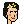 ⇒ 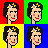
 or 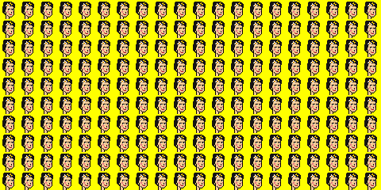
- [pixelart-characters](pixelart-characters) - generate pixel arts characters, algorithmically - paint by numbers - what about a new punk avatar portrait series? - yes, you can!

<!-- break -->

The Do-It-Yourself (DIY) [Factory of Modern Originals (FoMO)](https://github.com/pixelartexchange/originals) Presents

- [**moonbirds**](moonbirds) - generate your own 42×42 pixel owl images (off chain) from text attributes (via built-in spritesheet); incl. 2x/4x/8x zoom for bigger sizes and more    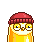 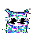 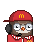
- [**cyberpunks**](cyberpunks) - generate your own cyberpunk (blade runner) sci-fi 32×32 pixel avatar images (off chain) from text attributes (via built-in spritesheet); incl. 2x/4x/8x zoom for bigger sizes and more     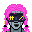 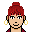
- [**nouns**](nouns) - generate your own 32×32 pixel avatar images (off chain) from text attributes (via built-in spritesheet); incl. 2x/4x/8x zoom for bigger sizes and more    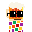 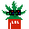 
- [**beaux & belles**](belles) - generate your own 24×24 beau & belle (pixel) head avatars images (off chain) from text attributes (via built-in spritesheet); incl. 2x/4x/8x zoom for bigger sizes and more   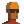 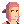 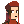
- [**coolcats**](coolcats) - generate your own 24×24 pixel cat images (off chain) from text attributes (via built-in spritesheet); incl. 2x/4x/8x zoom for bigger sizes and more     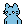  
- [**shiba-inus**](shibainus) - generate your own 24×24 pixel shiba inu doge images (off chain) from text attributes (via built-in spritesheet); incl. 2x/4x/8x zoom for bigger sizes and more        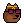 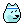
- [**goblins (& lil'goblins)**](goblins) - generate your own 24×24 goblins or 20×20 lil'goblins (pixel) monster avatars images (off chain) from text attributes (via built-in spritesheets); incl. 2x/4x/8x zoom for bigger sizes and more       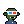 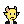 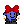,  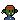 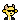 

## License

The scripts are dedicated to the public domain.
Use it as you please with no restrictions whatsoever.

## Questions? Comments?

Post them on the [D.I.Y. Punk (Pixel) Art reddit](https://old.reddit.com/r/DIYPunkArt). Thanks.

