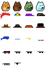
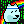
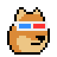
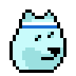

# Art Factory

Yes, you can! Generate your own pixel art images (off-blockchain) from text attributes (via spritesheets); incl. 2x/4x/8x zoom for bigger sizes and more


* home  :: [github.com/pixelartexchange/artfactory](https://github.com/pixelartexchange/artfactory)
* bugs  :: [github.com/pixelartexchange/artfactory/issues](https://github.com/pixelartexchange/artfactory/issues)
* gem   :: [rubygems.org/gems/artfactory](https://rubygems.org/gems/artfactory)
* rdoc  :: [rubydoc.info/gems/artfactory](http://rubydoc.info/gems/artfactory)


##  Usage

Let's try punk doge shiba inus in the 24x24px format.



(Source: [config/spritesheet.png](sandbox/config/spritesheet.png))

```
id, category, name, more_names
0, , classic,
1, , dark,
2, , zombie,
3, , alien,
4, , crazyhair,
5, , beanie,
6, , cap,
7, , capforward,
8, , cowboyhat,
9, , fedora,
...
```

(Source: [config/spritesheet.csv](sandbox/config/spritesheet.png))


###  Setup Variant 1


``` ruby
require 'artfactory'

# step 1 - setup the art factory;
#    pass-in the spritesheet image & (meta) dataset and
#    the format (e.g. 24x24px)

shiba1 = Artfactory.read( './config/spritesheet.png',
                          './config/spritesheet.csv',
                          width: 24,
                          height: 24)


# step 2 - generate images via text (prompts)

doge = shiba1.generate( 'Classic', '3D Glasses' )
doge.save( './doge1.png' )
doge.zoom(4).save( './doge1@4x.png' )

doge = shiba1.generate( 'Alien', 'Headband' )
doge.save( './doge2.png' )
doge.zoom(4).save( './doge2@4x.png' )

doge = doge.background( 'Matrix 1', 'Rainbow 1' )
doge.save( './doge2b.png' )
doge.zoom(4).save( './doge2b@4x.png' )
```

Resulting in:




4x:




###  Setup Variant 2

``` ruby
require 'artfactory'

# step 1 - setup the art factory;
#    use an "external" spritesheet configuration

sheet = Pixelart::Spritesheet.read( './config/spritesheet.png',
                                    './config/spritesheet.csv',
                                      width: 24,
                                      height: 24)
shiba2 =  Artfactory.use( sheet )


# step 2 - generate images via text (prompts)

doge = shiba2.generate( 'Classic', '3D Glasses' )
doge.save( './doge1.png' )
doge.zoom(4).save( './doge1@4x.png' )


doge = shiba2.generate( 'Alien', 'Headband' )
doge.save( './doge2.png' )
doge.zoom(4).save( './doge2@4x.png' )

doge = doge.background( 'Matrix 1', 'Rainbow 1' )
doge.save( './doge2b.png' )
doge.zoom(4).save( './doge2b@4x.png' )
```


## Questions? Comments?

Post them on the [D.I.Y. Punk (Pixel) Art reddit](https://old.reddit.com/r/DIYPunkArt). Thanks.
