# Moonbirds (Pixel Owls 'n' Friends)

moonbirds - generate your own 42×42 pixel owl images (off chain) from text attributes (via built-in spritesheet); incl. 2x/4x/8x zoom for bigger sizes and more


* home  :: [github.com/pixelartexchange/pixelart](https://github.com/pixelartexchange/pixelart)
* bugs  :: [github.com/pixelartexchange/pixelart/issues](https://github.com/pixelartexchange/pixelart/issues)
* gem   :: [rubygems.org/gems/moonbirds](https://rubygems.org/gems/moonbirds)
* rdoc  :: [rubydoc.info/gems/moonbirds](http://rubydoc.info/gems/moonbirds)


##  Usage

Let's generate some super-rare never-before-seen
moonbirds (pixel owls):

```ruby
require 'moonbirds'

########
## Moonbird No. 1
bird = Moonbird::Image.generate( "Tabby Brown",
                                 "Beak Small Orange",
                                 "Eyes Open White" )
bird.save( "moonbird1.png" )
bird.zoom( 4 ).save( "moonbird1@4x.png" )

## let's add 3D Glasses
bird = Moonbird::Image.generate( "Tabby Brown",
                                 "Beak Small Orange",
                                 "Eyes Open White",
                                 "3D Glasses" )
bird.save( "moonbird1b.png" )
bird.zoom( 4 ).save( "moonbird1b@4x.png" )

## let's add McDonald's Red  (from the Fast Food Series)
bird = Moonbird::Image.generate( "Tabby Brown",
                                 "Beak Small Orange",
                                 "Eyes Open White",
                                 "McDonald's Red" )
bird.zoom( 4 ).save( "moonbird1c@4x.png" )

## let's add Drive-Thru On Duty  (from the Fast Food Series)
bird = Moonbird::Image.generate( "Tabby Brown",
                                 "Beak Small Orange",
                                 "Eyes Open White",
                                 "McDonald's Red",
                                 "Drive-Thru On Duty" )
bird.zoom( 4 ).save( "moonbird1d@4x.png" )

## let's add McDonald's Shirt - Old Skool  (from the Fast Food Series)
bird = Moonbird::Image.generate( "Tabby Brown",
                                 "Beak Small Orange",
                                 "Eyes Open White",
                                 "McDonald's Red",
                                 "Drive-Thru On Duty",
                                 "McDonald's Shirt (Old Skool)" )
bird.zoom( 4 ).save( "moonbird1e@4x.png" )
```

Voila!


In 4x:

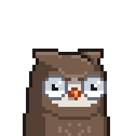
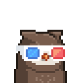
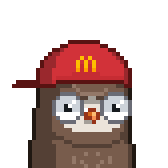
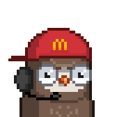
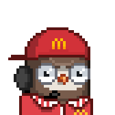


```ruby
###
#  Moonbird No. 2
bird = Moonbird::Image.generate( "Professor Golden",
                                 "Beak Small Golden",
                                 "Eyes Open Golden" )
bird.zoom( 4 ).save( "moonbird2@4x.png" )

## let's add Beanie
bird = Moonbird::Image.generate( "Crescent Golden",
                                 "Beak Small Golden",
                                 "Eyes Open Golden",
                                 "Beanie" )
bird.zoom( 4 ).save( "moonbird2b@4x.png" )
```

Voila!

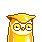


In 4x:


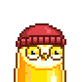


```ruby
###
#  Moonbird No. 3
bird = Moonbird::Image.generate( "Brave Glitch" )
bird.zoom( 4 ).save( "moonbird3@4x.png" )

## let's add a red background
bird = Moonbird::Image.generate( "Brave Glitch", background: 'red' )
bird.zoom( 4 ).save( "moonbird3b@4x.png" )

```

Voila!


In 4x:

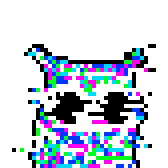
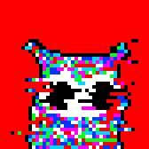


And so on.

### Bonus - Look-Up Attributes (Via Built-In  Spritesheet)


Let's look-up some attributes:

```ruby
_3d_glasses   = Moonbird::Sheet.find_by( name: '3D Glasses' )
beanie        = Moonbird::Sheet.find_by( name: 'Beanie' )
chromie       = Moonbird::Sheet.find_by( name: 'Chromie' )

mcdonalds_red = Moonbird::Sheet.find_by( name: "McDonald's Red" )

_3d_glasses.save( "3d_glasses.png" )
beanie.save( "beanie.png" )
chromie.save( "chromie.png" )
mcdonalds_red.save( "mcdonalds_red.png" )

_3d_glasses.zoom( 4 ).save( "3d_glasses@4x.png" )
beanie.zoom( 4 ).save( "beanie@4x.png" )
chromie.zoom( 4 ).save( "chromie@4x.png" )
mcdonalds_red.zoom( 4 ).save( "mcdonalds_red@4x.png" )
```

Voila!


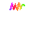


In 4x:

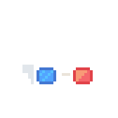
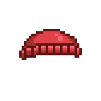

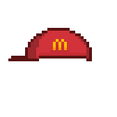

And so on.


## Questions? Comments?

Post them on the [CryptoPunksDev reddit](https://old.reddit.com/r/CryptoPunksDev). Thanks.
