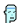

# Vector Graphics  (Experimental)


You may use the `PixelArt::Vector` canvas / object
for building vector graphics:


```ruby
require 'pixelart/base'


canvas = PixelArt::Vector.new( 24, 24 )   # 24x24 pixel

## face
canvas.path( stroke: 'black', fill: '#c8fbfb' ).line(
               6, 23,  6, 14,
               5, 14,  5, 13,  4, 12,
               5, 11,  6, 11,  6, 7,   7, 6,   8, 5,
               14, 5,  15, 6,
               16, 7,  16, 19,  15, 20,  14, 21,  10, 21, 10, 23 )

## mouth
canvas.path( stroke: 'black' ).line( 10, 18,  14, 18 )
## nose
canvas.path( stroke: '#9be0e0' ).line( 12, 16,  12, 14 )


## eyes
canvas.path( stroke: 'black' ).line( 9, 13,  9,  12 )
                              .line( 10, 12,  10, 11 )
                              .line( 14, 13,  14, 12 )
                              .line( 15, 12,  15, 11 )
canvas.path( stroke: '#9be0e0' ).line( 10, 13,  10, 12 )
                                .line( 15, 13,  15, 12 )
canvas.path( stroke: '#75bdbd' ).line( 9, 12,  9, 11 )
                                .line( 14, 12, 14, 11 )

## headband
canvas.path( stroke: '#1a6ed5' ).line( 7, 8, 15, 8 )
canvas.path( stroke: 'white' ).line( 7, 7,  15, 7 )


canvas.save( "./tmp/punk3100.svg" )
```


Voila!


## Modular "Glimmer" Version

You may use a [Glimmer](https://github.com/AndyObtiva/glimmer) Domain-Specific Language DSL) for vector graphics by requiring `'pixelart/glimmer'`
and including `Glimmer` module:

```ruby
require 'pixelart/glimmer'
include Glimmer # activates Glimmer DSL for Pixelart (in real apps, mix into a class instead)
```

Afterwards, you may build canvas vector graphics declaratively and hierarchically:

```ruby
def face
  line {
    coordinates 6, 23,  6, 14,
                5, 14,  5, 13,  4, 12,
                5, 11,  6, 11,  6, 7,   7, 6,   8, 5,
                14, 5,  15, 6,
                16, 7,  16, 19,  15, 20,  14, 21,  10, 21, 10, 23
    fill '#c8fbfb'
    stroke 'black'
  }
end

def mouth
  line( 10, 18,  14, 18 ) {
    stroke 'black'
  }
end

def nose
  line( 12, 16,  12, 14 ) {
    stroke '#9be0e0'
  }
end

def eyes
  path {
    line( 9, 13,  9,  12 )
    line( 10, 12,  10, 11 )
    line( 14, 13,  14, 12 )
    line( 15, 12,  15, 11 )

    stroke 'black'
  }

  path {
    line( 10, 13,  10, 12 )
    line( 15, 13,  15, 12 )

    stroke '#9be0e0'
  }

  path {
    line( 9, 12,  9, 11 )
    line( 14, 12, 14, 11 )

    stroke '#75bdbd'
  }
end

def headband
  line( 7, 8, 15, 8 ) {
    stroke '#1a6ed5'
  }

  line( 7, 7,  15, 7 ) {
    stroke 'white'
  }
end

image = canvas(24, 24) {
  file './tmp/punk3100.svg' # auto-saves file when canvas expression closes

  face
  mouth
  nose
  eyes
  headband
}

# Re-open content to modify attributes and add more shapes
image.content {
  file './tmp/punk3100-round-nose.svg' # auto-saves file when content closes

  ## Round Nose
  circle( 12, 15,  1 ) {
    fill '#9be0e0'
  }
}
```

Voila!

 
