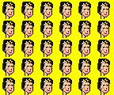
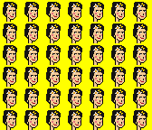

# Pop Art Helpers


Use the free pop art image helpers
to turn your pixel art
into multi-million dollar pop art orginals!


## Usage

Let's try the portrait of Frida (Kahlo) 
in the classic 24×24 pixel art format:

``` ruby
require 'popart'

frida = Image.read( 'i/frida_kahlo-24x24.png' )
```


### Double Frida (2×1)

Let's try `Image#double` also known as `Image#two` or `Image#double_ii`:

``` ruby
YELLOW = '#ff0000'   # let's try a yellow background  - color encoded in rgb (red/green/blue) hex

popart = frida.double( background: YELLOW )
popart.save( 'i/frida-double.png' )
```

And voila - Las Dos Fridas :-)


Note: You can make the artwork bigger using the `Image#zoom` method using a "loss-free" double the pixel algorithm.
Let's try 8x:

``` ruby
popart.zoom(8).save( 'i/frida-double@8x.png' )
```

8x <br>


### Triple Frida  (3×1)

Let's try `Image#triple` also known as `Image#three` or `Image#double_iii`:

``` ruby
popart = frida.triple( background: YELLOW )
popart.save( 'i/frida-triple.png' )
```

And voila!


### Thirty Fridas Is Better Than One (6×5)

Let's try `Image#thirty` also known as `Image#double_xxx`:

``` ruby
popart = frida.thirty( background: YELLOW )
popart.save( 'i/frida-thirty.png' )
```

And voila!




### Forty-Two Fridas Is Better Than One (7×6)

Let's try `Image#fortytwo` also known as `Image#double_xlii`:

``` ruby
popart = frida.fortytwo( background: YELLOW )
popart.save( 'i/frida-fortytwo.png' )
```

And voila!




### Two Hundred Fridas Is Better Than One (20×10)

Let's try `Image#twohundred` also known as `Image#double_cc`:

``` ruby
popart = frida.twohundred( background: YELLOW )
popart.save( 'i/frida-twohundred.png' )
```

And voila!


And so on.


## Frequently Asked Questions (F.A.Q.s) And Answers


### Q: What about different background colors?

A: Yes, you can. Pass in the background colors as a list / array. Let's try a
Quadruple Frida with red, green, yellow and blue backgrounds:

``` ruby
YELLOW = '#ffff00'
RED    = '#ff0000'
GREEN  = '#00ff00'
BLUE   = '#0000ff'

popart = frida.quadruple( background: [RED, GREEN, YELLOW, BLUE] )
popart.save( 'i/frida-quadruple.png' )
```

And voila!


### Q: What about Elvis or Mona Lisa or Jesus Christ or Marilyn Monroe or Billie Eilish or ...?

A: Yes, you can.  See the [**Readymade Pixel Punks - The World's Greatest (and Worst) Characters & (Historic) Figures in 24×24 Pixel Art**](https://github.com/cryptopunksnotdead/punks.readymade)
for free downloads to get started with your own pop art originals today!


## Questions? Comments?

Post them on the [D.I.Y. Punk (Pixel) Art reddit](https://old.reddit.com/r/DIYPunkArt). Thanks.


