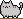
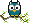
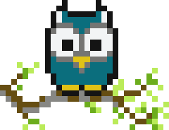
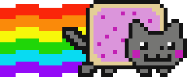

# Programming Pixel Art

Pixel Art Samples from
[Creating Pixel Art by Gray Wolf](https://www.khanacademy.org/computer-programming/i/6192620261818368) @ Khan Academy, May 2021

Mario

8x 

Cat

8x 

Among Us

8x 

Black Cat

8x 

Owl

8x 

Nyan Cat

8x 

See the [**samples.rb**](samples.rb) script
to (re)generate the pixel art.

## Questions? Comments?

Post them on the [D.I.Y. Punk (Pixel) Art reddit](https://old.reddit.com/r/DIYPunkArt). Thanks.

