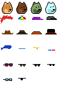

# Spritesheet


* home  :: [github.com/pixelartexchange/artfactory](https://github.com/pixelartexchange/artfactory)
* bugs  :: [github.com/pixelartexchange/artfactory/issues](https://github.com/pixelartexchange/artfactory/issues)
* gem   :: [rubygems.org/gems/spritesheet](https://rubygems.org/gems/spritesheet)
* rdoc  :: [rubydoc.info/gems/spritesheet](http://rubydoc.info/gems/spritesheet)


##  Usage

### Pack(age)-Up Spritesheet(s)


Let's try some punk readymades
with "stand-alone" images:

```
i/bart_simpson.png
  dante_alighieri.png
  galileo_galilei.png
  mao_zedong.png
  snoop_dogg.png
  terminator.png
  the_grinch.png
  the_joker.png
  the_mask.png
  william_shakespeare.png
```

and with a attributes (definition) in the comma-separated values (.csv) format:

```
path, category, name, more_names


william_shakespeare.png,,  William Shakespeare,   Will | Will Shakespeare | Shakespeare
dante_alighieri.png,,  Dante Alighieri,   Dante

galileo_galilei.png,,  Galileo Galilei,   Galileo | Galilei

mao_zedong.png,,       Mao Zedong,        Mao

snoop_dogg.png,,       Snoop Dogg,        Snoop

bart_simpson.png,,     Bart Simpson,     Bart | Simpson
terminator.png,,       Terminator

...
```

(Source: [spritesheet/attributes.csv](sandbox/spritesheet/attributes.csv))


``` ruby
require 'spritesheet'

attributes_path  =  './attributes.csv'
image_dir        =  './i'


sheet = Pixelart::Spritesheet.pack( attributes_path,
                                      dir: image_dir,
                                      width: 24,
                                      height: 24 )

pp sheet.records
puts "  #{sheet.records.size} record(s)"

sheet.export( "./spritesheet_pack.csv" )

sheet.image.save( "./spritesheet_pack.png" )
sheet.image.zoom(4).save( "./spritesheet_pack@4x.png" )
```


And use spritsheet reference
for image generation and lookup:

``` ruby
sheet.image[0].zoom(4).save( "./sprite0_pack@4x.png" )
sheet.image[1].zoom(4).save( "./sprite1_pack@4x.png" )

will      = sheet.find_by( name: 'Will' )
galileo   = sheet.find_by( name: 'Galileo' )

will.save( "./will.png" )
will.zoom(4).save( "./will@4x.png" )

galileo.save( "./galileo.png" )
galileo.zoom(4).save( "./galileo@4x.png" )
```


### Read (Pre-Packaged-Up) Spritesheet(s)

Let's try punk doge shiba inus in the 24x24px format.



(Source: [config/spritesheet.png](sandbox/config/spritesheet.png))

```
id, category, name, more_names
0, , classic,
1, , dark,
2, , zombie,
3, , alien,
4, , crazyhair,
5, , beanie,
6, , cap,
7, , capforward,
8, , cowboyhat,
9, , fedora,
...
```

(Source: [config/spritesheet.csv](sandbox/config/spritesheet.png))


``` ruby
require 'spritesheet'


image_path =  './config/spritesheet.png'
meta_path  =  './config/spritesheet.csv'

pp recs = Pixelart::Spritesheet.read_records( meta_path )
puts "  #{recs.size} record(s)"
pp recs = Pixelart::Spritesheet.read_meta( meta_path )
puts "  #{recs.size} record(s)"

sheet = Pixelart::Spritesheet.read( image_path,
                                    meta_path,
                                    width: 24,
                                    height: 24 )

pp sheet.records
puts "  #{sheet.records.size} record(s)"
pp sheet.meta
puts "  #{sheet.meta.size} record(s)"


sheet.image.save( "./spritesheet.png" )

sheet.image[0].zoom(4).save( "./sprite0@4x.png" )
sheet.image[1].zoom(4).save( "./sprite1@4x.png" )

classic = sheet.find_by( name: 'Classic' )
alien   = sheet.find_by( name: 'Alien' )

classic.save( "./classic.png" )
classic.zoom(4).save( "./classic@4x.png" )

alien.save( "./alien.png" )
alien.zoom(4).save( "./alien@4x.png" )


classic = sheet[ 'Classic' ]
alien   = sheet[ 'Alien' ]

classic.save( "./classic-ii.png" )
classic.zoom(4).save( "./classic-ii@4x.png" )

alien.save( "./alien-ii.png" )
alien.zoom(4).save( "./alien-ii@4x.png" )
```


## Questions? Comments?

Post them on the [D.I.Y. Punk (Pixel) Art reddit](https://old.reddit.com/r/DIYPunkArt). Thanks.
